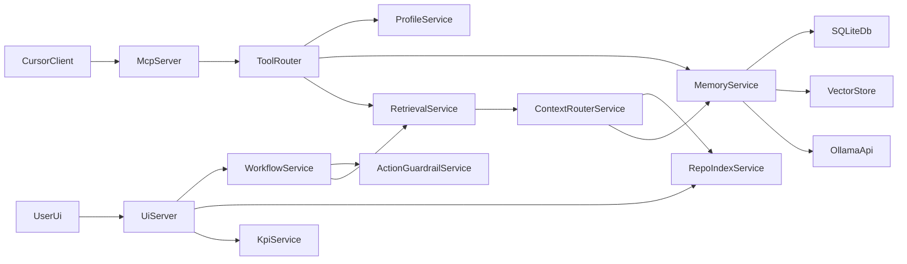

# LDMS Architecture

LDMS is local-first by default: data is persisted in SQLite, vectors are stored locally, and embeddings are requested from Ollama.

## Runtime options

- Local runtime: `bundle exec ruby app/mcp/server.rb`
- Container runtime: `docker compose run --rm -T ldms-mcp`

`scripts/start_mcp.sh` auto-selects local runtime first, then container fallback. Override with `LDMS_RUNTIME=local` or `LDMS_RUNTIME=docker`.

## Data model

Primary tables:
- `memories`
- `vectors`
- `decisions`
- `sessions`
- `mcp_requests`
- `repo_index_entries`
- `workflow_runs`
- `memory_feedback`
- `app_settings`

`MemoryService` writes to `memories` and `vectors`. `ContextRouterService` combines memory, repo index, decision history, and git context into a traceable packet. `WorkflowService` persists guarded workflow previews and rollback metadata in `workflow_runs`.
